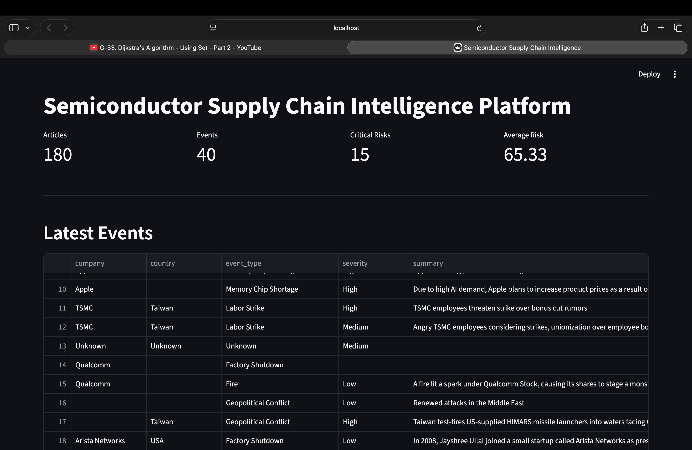

# Semiconductor Supply Chain Intelligence Platform

---

## Dashboard

### Overview



---

### Metrics


---

### Company & Country Risk


---

### Executive AI Summary


An AI-powered platform that monitors semiconductor supply chain disruptions using real-world news, extracts risk events using Llama 3.2, calculates risk scores, and visualizes the results in an interactive Streamlit dashboard.

---

## Features

- News collection using NewsAPI
- Automatic article downloading
- Llama 3.2 based event extraction
- Risk classification
- Company risk analytics
- Country risk analytics
- Executive AI summary generation
- Interactive Streamlit dashboard

---

## Tech Stack

- Python
- SQLite
- Streamlit
- Ollama (Llama 3.2)
- NewsAPI
- Newspaper4k
- Pandas

---

## Pipeline

NewsAPI

↓

Download Full Articles

↓

LLM Event Extraction

↓

Risk Scoring

↓

Company Analytics

↓

Country Analytics

↓

Executive Summary

↓

Dashboard

---

## Run

Create virtual environment

```
python -m venv venv
source venv/bin/activate
```

Install

```
pip install -r requirements.txt
```

Run

```
python -m app.main
```

Dashboard

```
streamlit run dashboard/streamlit_app.py
```